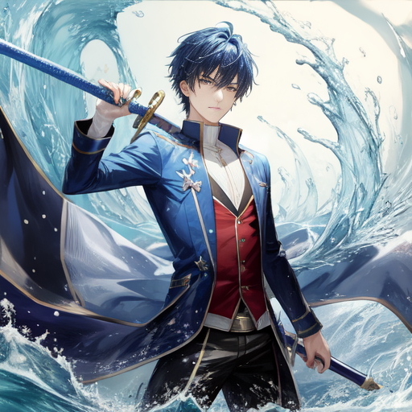
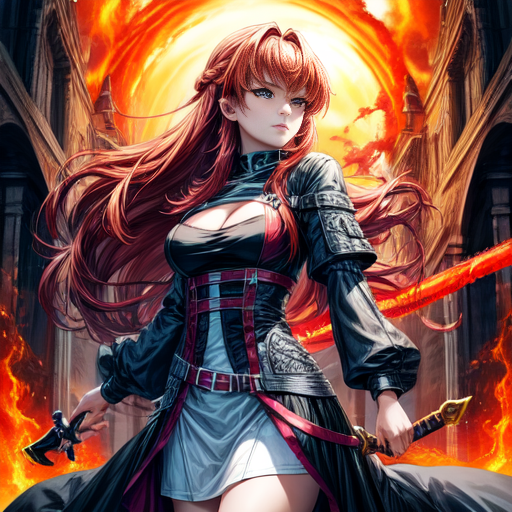
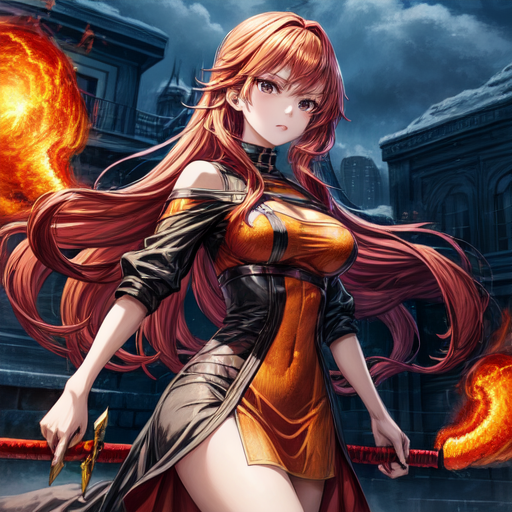

# Project Valerie?
## Huge concept:
1. God decided to update earth, everyone is an avatar (benders, not blue) but nerfed. Can't hurt others, but *PVP* exists
2. Set in final year of high school one year after the "update" for plot reasons:
   1. People still learns how to use their bending powers, accept it as part of their live. Competitive battling (Legend of Korra 3v3 style) is socially acceptable
   2. Alot of free time after exams
   3. Easy transitioning for adding/removing characters out, or branching stories in a side chapter kind of way
   4. May give different point of views from different schools
3. Combat system is geared towards 3v3 style, characters meet each other on the arena. Battling each other should be the main plot mover of the story line. Characters meet each other should be focused on battles.
4. Character hair will identify what element are they on

## Gameplay principles:
- Story should be told in a Katana: Zero kind of way, integrated to the gameplay, choices matter but some cannon events are unavoidable
- Gameplay should be crispy in a league of legends kind of way. Outplaying opponents should trigger huge boner

## Battle system ideas:
Ideas for battle systems:
- turn based:
  - Easier to implement
  - Boring
  - Harder to make interesting, must be tailored to perfection
- Platformer battle (Tekken + Dynasty Warriors):
  - Dynasty Warriors combo system should feel nice and will trigger boner
  - Hardest to implement and balancing
  - Easier to break up fights for the sake of plot
- Auto Battler (TFT):
  - Maybe hard to implement
  - Gameplay may feel flat, but if executed correctly can trigger boner
  - Very easy to accidentally make another GFL/PriConne replicate
  - Focuses on upgrading characters each rounds, and careful positioning

## Battling Fundamentals:
In a 3v3 scenario, each team would have 3 main positions (league of legends term) which can be simplified as:
- Position 1 (High resource):
  - Equivalent to AD Carry in League, number 9 in Football
  - Main damage dealer
  - Can't function well alone
- Position 2 (Medium Resource):
  - Equivalent to top laner in League, winger in football
  - Can function alone as a duelist/juggernaut/tank but not necesarrily
- Position 3 (Low Resource):
  - Equivalent to Support role in League, full back in Football
  - 2 main sub class:
    - Engage (Leona, Nautilus): Mainly setup for Carries and start fights
    - Enchanter (Nami, Janna, Sona): Peel for pos 1, 2

Battles should be an Arena style (think of 2v2v2v2 mode in League, but 3v3)
Team playstyles (for plot):
- Position 2 isolation:
  - Position 2 looks for a solo play, so P3 can play for P1 with more freedom
- Hard engage:
  - P3 looks to setup and find 3v3s
- Double P2s:
  - Lack in damage, but both P2s can play alone for flexibility


## Character Ideas:
*for the sake of character concepting, stable diffusion is used. It should cover mainly skin color, hair, and general vibe of the character*
**Stable Diffusion models tends to inflate chests, final character concepts should not necessarily have large chests**

### Main Character Male:
**Main Character male**<br>

- From School A (main setting)
- Water element
- P2 Duelist, Fiora Style?
- Specializes in Isolation plays
- Funny, witty, entertaining, kinda weird


### Main Character Female:

- From School B (School A Rival)
- Fire Battle Mage, Diana style
- Fights heads on, big engage
- Can't date anybody, because of status and ambition
  - Plot Device idea:
    - Celebrity, can't date anyone anyhow
    - Will eventually go out of the country, doesn't want strings attached
- Met Main Character in a battle, fought hard but got outplayed and 

### **Main Character Romance:**
- **Should end in a bad way**
- Female warns MC Countless of time, that she can't date anybody because of her status and ambitions
- Male kept hitting
- Female eventually fell, but still persists on never will date anyone
- Main theme song:
  ```
    Main Theme

    Kita hanyalah teman satu angkatan
    Saling menyapa hanya dengan tatapan
    Menepuk bahu sebelah kanan
    Menawarkan mu sebuah cemilan

    *BAIT 2*

    Reff:
    Kita spasang teman yang sempurna
    Saling mengerti dan mendoakan
    namun mengapa
    Ku jadi Suka
    tidak selayaknya

    Kita spasang teman yang sepadan
    Saling menjaga dan mengajarkan
    namun mengapa
    Ku Jadi Suka
    Tidak seharusnya


    Bridge:
    Dikala ku sadar dan ku menangis
    Bahwa ku tahu kita sbatas teman saja
    haruskah ku coba tuk mengejar
    Kan ku pendam slamanya
    Rasa yang ku miliki

    *Reff*


  ```


